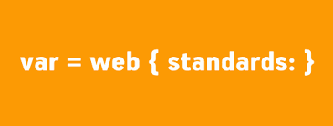
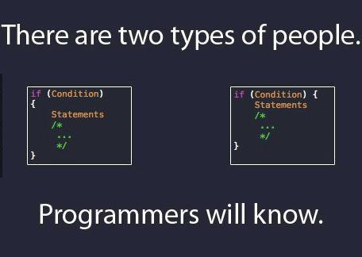

Coding standards define a way of writing a well-organized code with high legibility.
From putting the curly brackets properly to setting the number of spaces to use for indentation,
use of coding standards can make programmer's life easier.

## Which way is better ?

When I first entered the world of programming, I did not know how to write a legible code. It did not matter much, as long as my program runs properly. However, getting away with no coding standards only lasted for so long. The program structure course I took required students to write hundreds of code. Even tiny mistakes such as not aligning codes according to its scope or putting extra spaces between the curly brackets made it very difficult to read and fix errors or even follow through my own code. That is when I finally realized the importance of coding standards.

The professor recommended students to put starting curly bracket on a new line by itself after the function parameters, and align the closing brackets accordingly. It looked very strange because I have always been putting the starting brackets right next to the function parameters. However, as I was following his coding standard, I started liking his style better than the old one. Now I am more used to putting the starting curly brackets on a newline by itself, which makes it easier to distinguish different functions better. The point is that it is definitely beneficial to have coding standards, but it is as important to find the right style that you feel most comfortable with.

## ESLint -- Yes or No

Using [ESLint](eslint.org) with [IntelliJ](https://www.jetbrains.com/idea/) is going pretty well so far. Getting the green checkmark can be painful sometimes, since I have my own way of writing and organizing code, but I think it is definitely a good practice. One thing I do not like about ESLint is restricting the use of syntax I am familiar with, such as i++ / i-- . Other than that, ESLint is a very useful tool to learn proper way of coding.  
