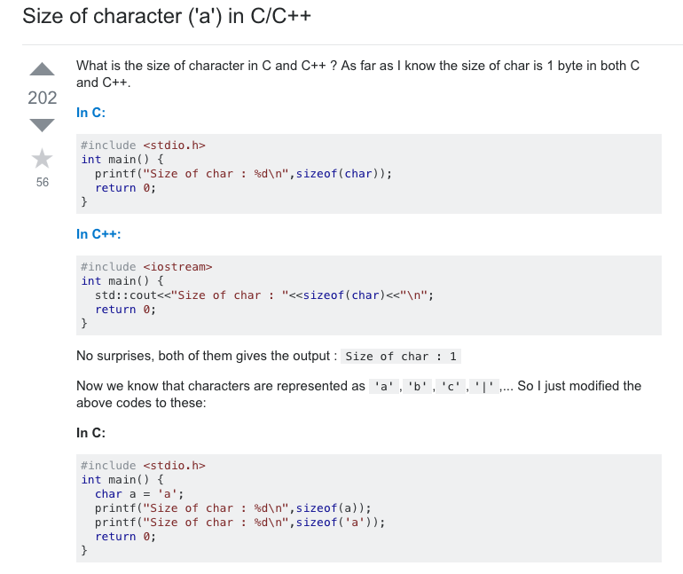
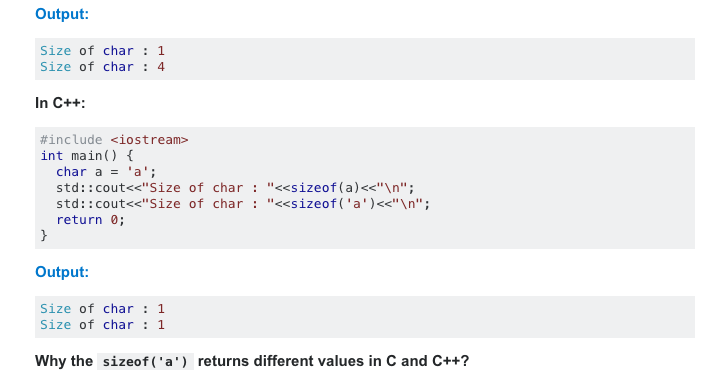

## Questions? Questions!

A question is a linguistic expression used to make a request for information (Wikipedia). Is it possible for a human being to know all the information needed in life? The answer is no. The amount of knowledge differs from a person to person. Thus, when people run into problems in life, they ask questions. In software engineering field, asking questions is a must. Well, it might not be for some smart people, but for the most part I strongly believe that it is. This is because the field is too vast that one can never learn 100% of programming. Programmers will always run into problems, in other words, errors. [Stack Overflow](www.stackoverflow.com) is a great website for programmers to ask/answer questions. When stuck, the best way to solve a problem is to ask questions to those who would know about the problem really well. However, when asking a question, it is very important to make it clear, so people could understand it fully and give answers accordingly. With that being said, what is a smart way to ask question? and what is a not smart way to ask question? Luckily, Eric Raymond has provided the guidelines on distinguishing the two.

## Smart questions ---

According the Eric Raymond, a smart question has meaningful subject headers that gives readers brief ideas on what it is about. For example,"[C programming] scanf error" would be a better subject header than "I need HELP! My Program is not working!". 

Above is a good example of a smart question. The author used a specific subject header mentioning what kind of programming language is being used and what problem he/she encountered. The question also has a proper introduction sentence stating what the problem is. Then the author puts example codes and the outputs below using appropriate code blocks and syntax highlighting, which makes it easier for people to understand the problem more in detail. Lastly, the author asks the question in one simple sentence to clarify what the question is. In this way, it is easier for other people to fully understand what is going on and they are able to answer or give tips how / which part of the code is causing the error.

## Not so smart....Huh?

Here is an example of a not smart question on Stack Overflow:

In Eric Raymond's guidelines it is said, before you ask a question:

1. Try to find an answer by searching the archives of the forum or mailing list you plan to post to.
2. Try to find an answer by searching the Web.
3. Try to find an answer by reading the manual.
4. Try to find an answer by reading a FAQ.
5. Try to find an answer by inspection or experimentation.
6. Try to find an answer by asking a skilled friend.
7. If you're a programmer, try to find an answer by reading the source code.

And yes, the answer to the question could easily be found with all of the above. 
These kind of questions are waste of time for the people who are willing to help. To not get an answer like "Java and Javascript are similar like Car and Carpet are similar", it is important to ask questions in the 'smart' way.
