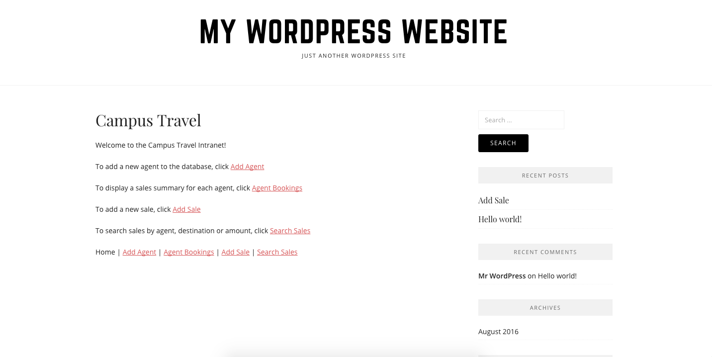

This project is a WordPress Website I developed in ICS415, Fall 2016. For the most of the part, the project focused on dealing with databases using [Cpanel](https://cpanel.com/).
In Cpanel, I used [MySQL Databases](https://www.mysql.com/) to create the databases. [PhpMyAdmin](https://www.phpmyadmin.net/) was used to import and export data tables made with Microsoft Excel, and generate data tables used for the actual application made.
With the information stored in databases, I created various html/php files to create the actual application which is called the CampusTravel. This is a simple travel intranet application that allows the user to look up the amount of sales made by the agents.
The application has following features: Add Agent, Agent Bookings, Add Sale, Search Sales, and Update Sale. 

By doing this project, I learned how to work with databases. I believe that the skills I obtained through this project would be very helpful to fulfill my goal of becoming a web developer.
 
Source: <a href="http://ahlim.ics415.com/">MyWordPress Website</a>
