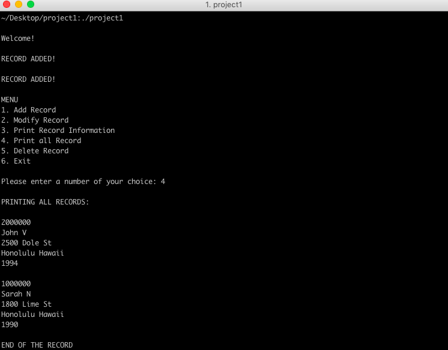

This is a bank application project I developed in 2016. The program is written in the [C programming langauge](http://www.tutorialspoint.com/cprogramming/c_overview.htm?). When executed, the program attempts to read an input file that contains customer names, addresses, and years of birth. There are 6 options in menu: 

1. Add Record 
2. Modify Record
3. Print Record
4. Print All Records
5. Delete Record
6. Exit Program. 

After executing a command, the menu is displayed again until the exit option is selected. The program allows accounts to have the same account number. After the program is properly exited, it will write the changes back to a new record file that can be later reopened.

This is by far the longest and the most challenging program I have ever written. This project has definitely helped improve my programming skills, especially in the C programming language. It also helped me to understand data structures better, such as linked lists, stacks, and heaps.

Demo: <a href="https://github.com/ahlim0m/bank_application"><i class="large github icon "></i>ahlim0m/bank_application</a>

