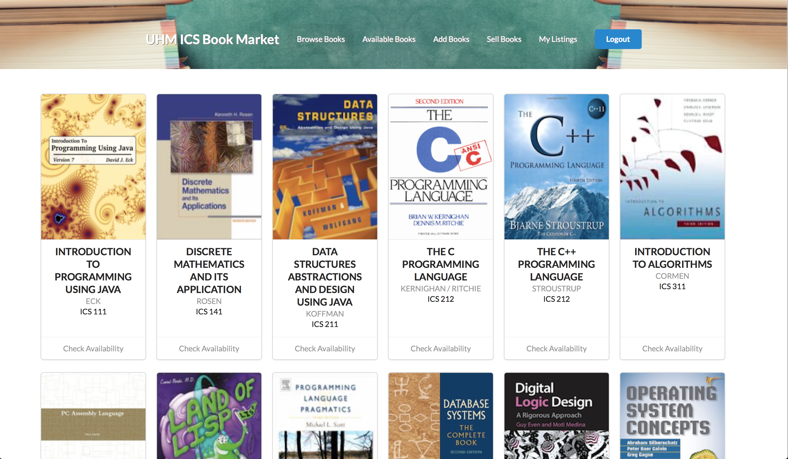
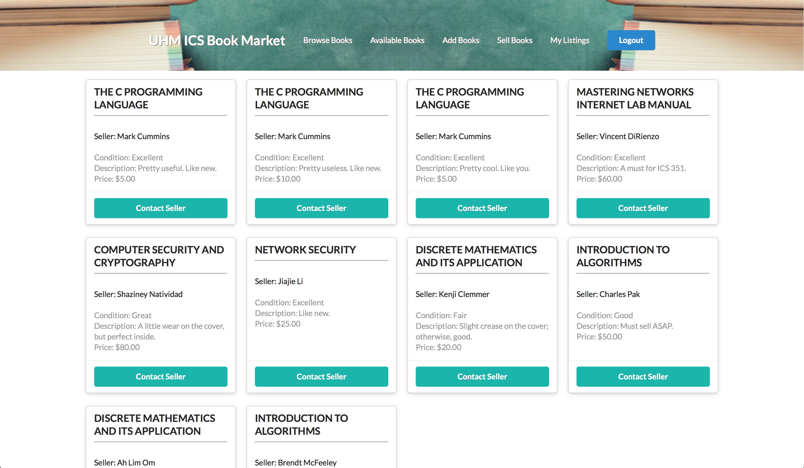

ICS Book Market a web application designed for ics students at UH to buy and sell used textbooks. HTML, CSS, and Javascript were used to build the application. Semantic UI was used as framework. 
The application has several pages:

1. Landing Page 
2. Home Page
3. Browse Books Page
4. Avaiable Books Page
5. Add Books Page
6. Sell Books Page
7. Your Listings Page

Since the website is exclusively designed for UH students, a valid UH ID is required. Once logged-in, the user is able to view information on all the textbook required for ICS major, check their availabilities, upload a book for sale, add a book to the book list, and view their listings.
My Contribution to the project was creating the browse books page and add books page. I first created a collection of book data, which was used as a base for many other pages such as sell books or check available books.

Working on the project has made me realize the importance of github. Without version control, it would have been a total disaster. Thanks to github/git, our team was able to work indivisually or as a whole without any conflicts or broken codes.
Also, I have learned a lot about functional programming, and front-end tasks. Watching the tutorial videos helped a bunch to understand the complex code sturctures and functions. Last but not least, I finally learned how to build a website from the scratch that is fully functional, up and running.

Unfortunately, our group have encountered some problems and were unable to create some of the features we expected to include, which we plan to continue to figure out how to solve the existing problems and improve our project.
More details about ICS Book Market can be found [Here](https://icsbookmarket.github.io/).
